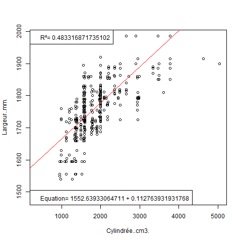
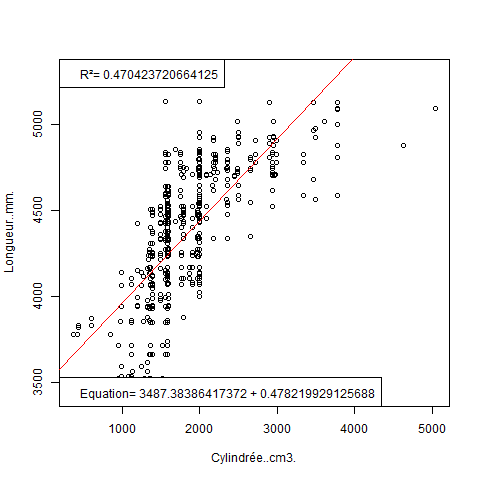
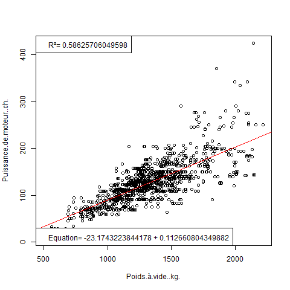
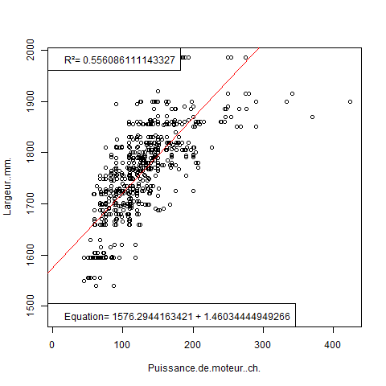
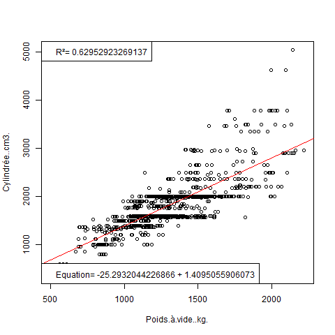
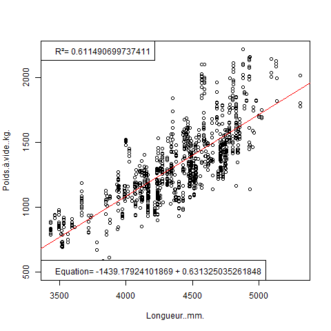
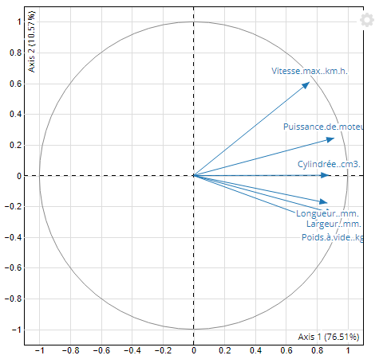
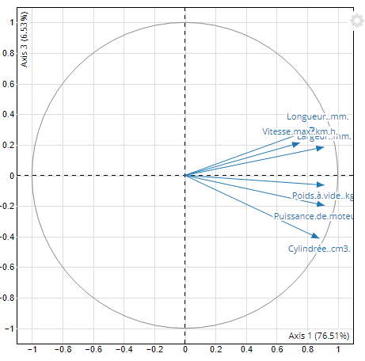

# 🧮Interpretation des résultats

## Quelles sont les véhicules qui se ressemblent selon les caractéristiques choisis ?

En ce basant sur la corrélation des variables prise 2 à 2, on observe que :

* Les voitures possedant une cylindrée et une largeur corrélée ressemble au voiture avec une cylindrée et une longueur corrélée

* Les voitures possedant un poid à vide et une puissance moteur corrélée ressemble au voiture avec une largeur et une puissance moteur corrélée

  
* Les voitures possedant une longueur et un poid à vide corrélée ressemble au voiture avec une cylindrée et un poid à vide corrélée

  
* etc... On remarque que les vehicules qui se ressemble en fonction des variables observées sont ce qui possède une corrélation proche et donc une courbe de regression l'innéaire se ressemblant

## Sur quelles variables sont fondées les ressemblances / dissemblances ?

On voit que les ressemblances sont fondé sur les  variable :

* cylindrée
* longeurs
* largeurs
* poids à vide

Alors que les dissemblances ont l'aire d'être causé par :

* vitessse max
* puissance du moteur

## Quelles sont les relations entre les variables ?

Les plus grandes relations entres les variables sont : 

* Entre la cylindrée et la longeurs de la voiture
* Entre la cylindrée et la largeurs de la voiture
* Entre la vitesse max et la puissance du moteur
* Entre le poids à vide et la vitesse max

